# 通过第三方MQTT服务接入设备

在某些场景,设备不是直接接入平台,而是通过第三方MQTT服务,如:`emqtt`.
消息编解码与MQTT服务一样,从消息协议中使用`DefaultTransport.MQTT`来获取消息编解码器.
本文使用mqtt.fx为设备端，通过emqtt接入平台。

## 创建MQTT客户端网络组件

1. 选择 `网络组件`-->`组件管理`--> 点击`新增组件`按钮。  
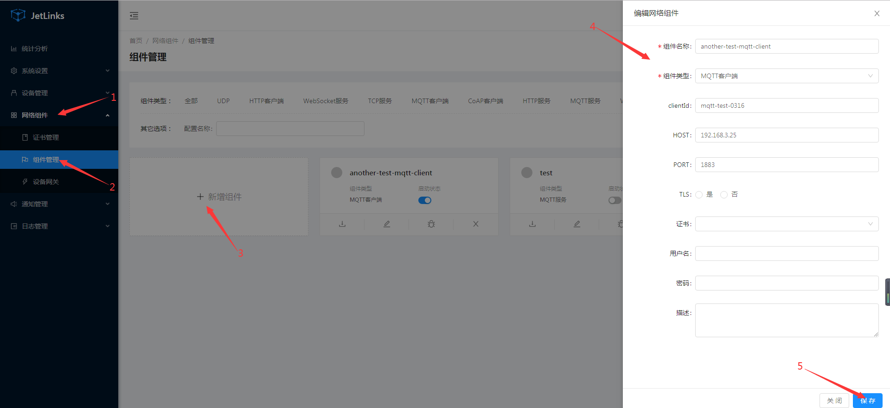  
2. 在创建完成的模块上点击`启动`按钮。  
  

## 创建MQTT客户端设备网关

1. 选择 `网络组件`-->`设备网关`--> 点击`新建`按钮。
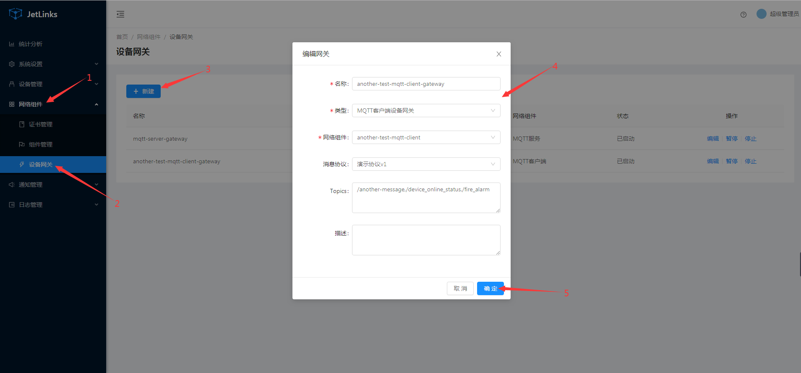  
::: tip 注意
和MQTT服务设备网关不同的是,客户端必须指定消息协议,因为无法通过消息识别出对应的设备标识.
在消息解码时也无法通过上下文(`MessageDecodeContext`)获取到设备操作接口(`DeviceOperator`).
此处使用`演示协议v1`.
:::
此处使用的Topics:`/read-property,/device_online_status,/fire_alarm`。
2. 在操作列点击`启动`按钮启动网关。  
   

## 安装并启动EMQ

可直接前往[官网下载](http://www.emqtt.io/downloads/) emqttd。  
本文使用docker搭建。  
### 拉取镜像  
```shell script
docker pull registry.cn-hangzhou.aliyuncs.com/synbop/emqttd:2.3.6
```
### 运行镜像  
```shell script
docker run --name emq -p 18083:18083 -p 1883:1883 -p 8084:8084 -p 8883:8883 -p 8083:8083 -d registry.cn-hangzhou.aliyuncs.com/synbop/emqttd:2.3.6
```
### 访问EMQ Dashboard
在浏览器中输入 http:192.168.99.100: 18083,默认账号密码为用户名：admin 密码：public。

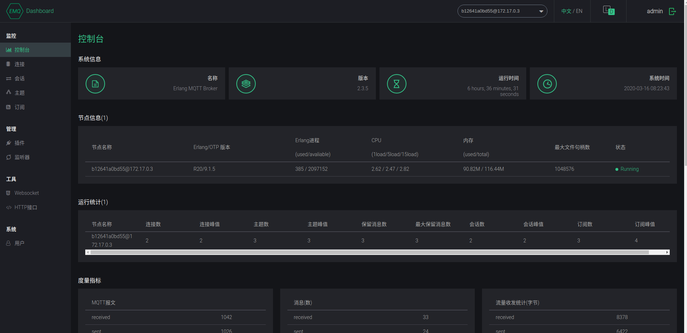

## 使用MQTT.fx连接EMQ

### 设置连接参数。  
配置参数请参考[使用MQTT.fx接入](../advancement-guide/mqtt-connection.md#使用MQTT.fx接入)。

**此处参数设置：**  

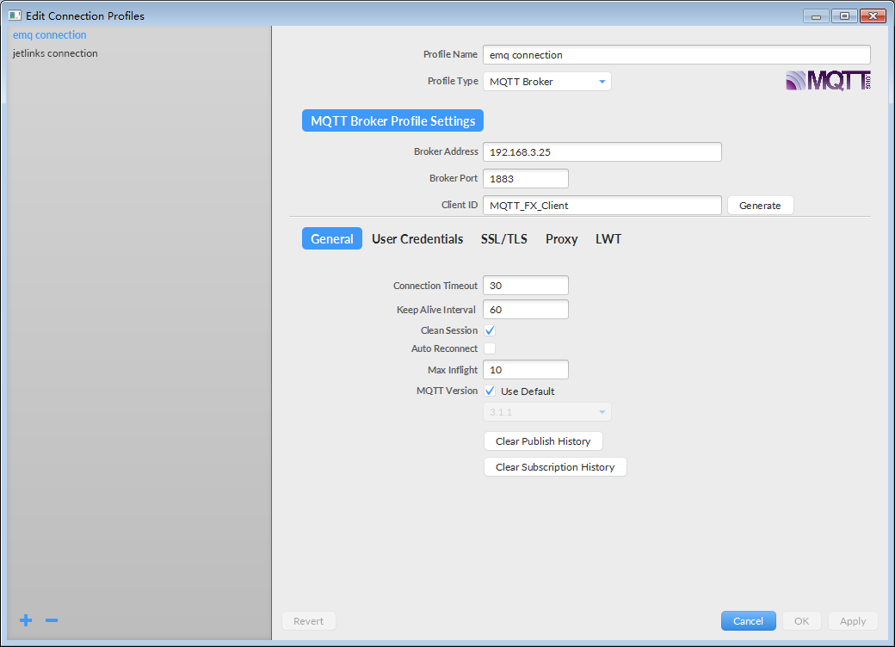  

### 连接EMQ
单击 Mqtt.fx客户端 中`Connect`进行连接。  
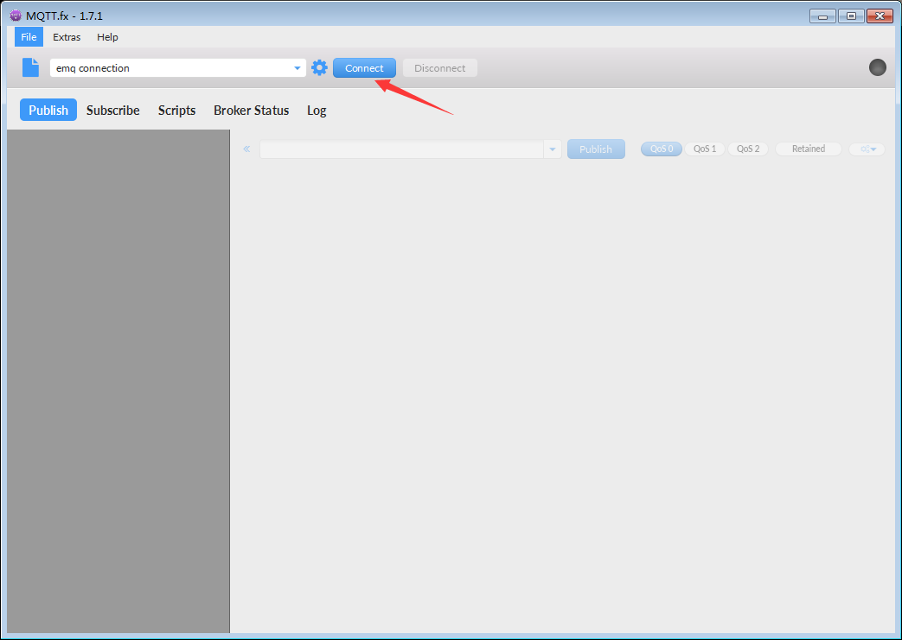

连接成功后EMQ Dashboard页面上将会显示这条连接记录。  
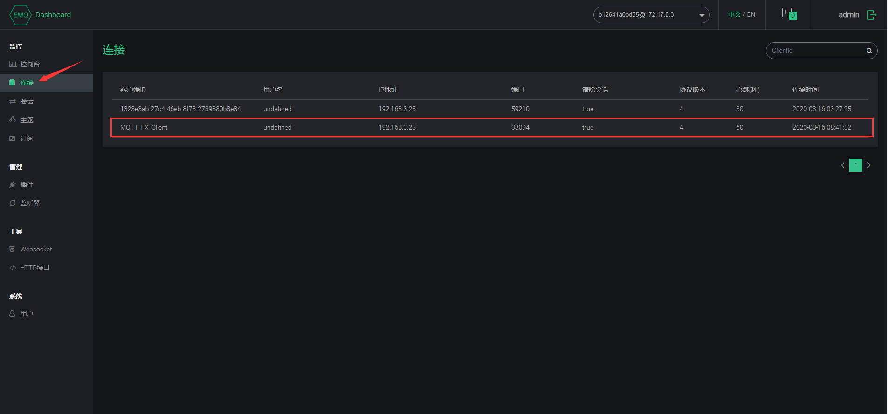  

## 模拟设备上下线

使用MQTT.fx模拟设备上下线。  
1. 单击 `Publish`。

2. 输入设备上下线的topic和事件内容，点击单击Publish按钮,将消息推送到EMQ，
EMQ将消息转发到平台。  

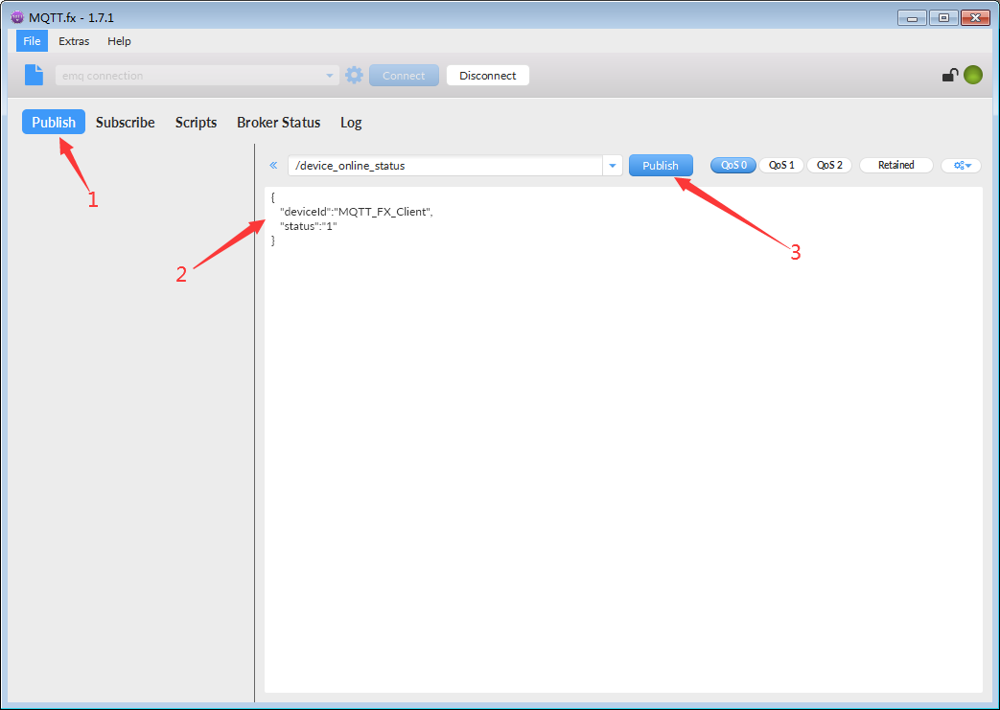  
此处使用的topic: `/device-online-status`

此处使用的事件内容：  

```json
{
   "deviceId":"MQTT_FX_Client",
   "status":"1"
}
```
消息发送成功后：  
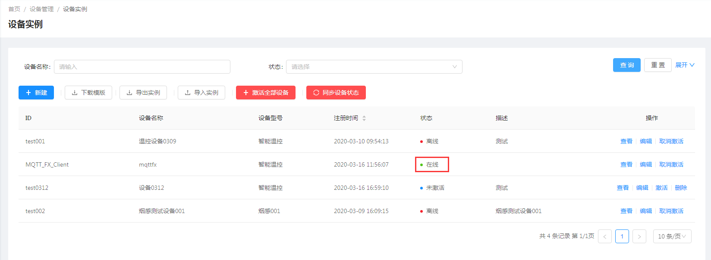 

离线操作及效果展示：  
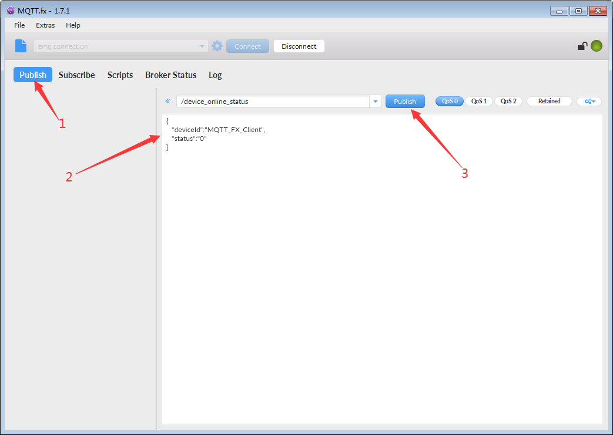  

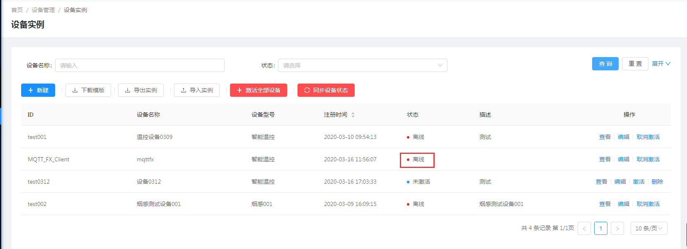  

## 模拟设备消息订阅

1. 在MQTT.fx上点击`Subscribe`,输入topic：`test`，点击Subscribe按钮订阅。  
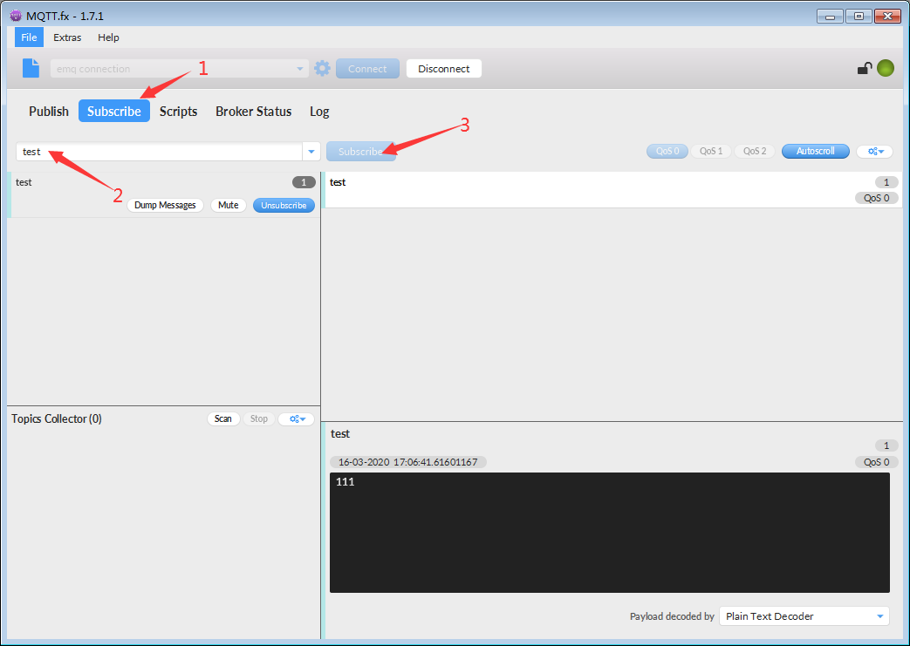  

2. 在平台中选择 `网络组件`-->`组件管理`，找到[MQTT客户端组件](#创建MQTT客户端网络组件)，点击`调试`按钮。  
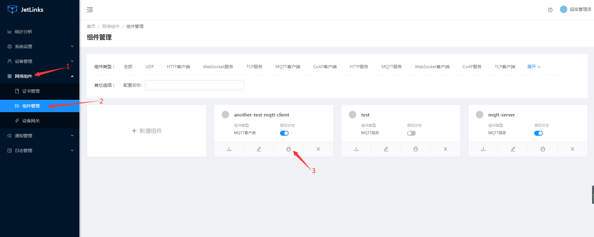

3. 在调试页面，选择`推送消息`,编辑内容后，点击`发送`按钮，MQTT.fx将会收到消息。  

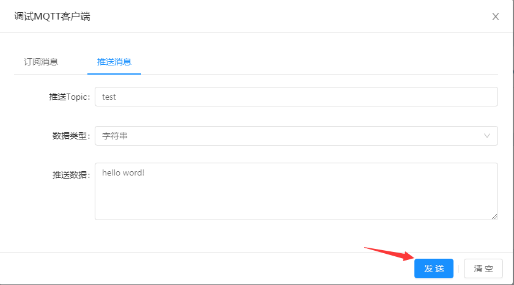  

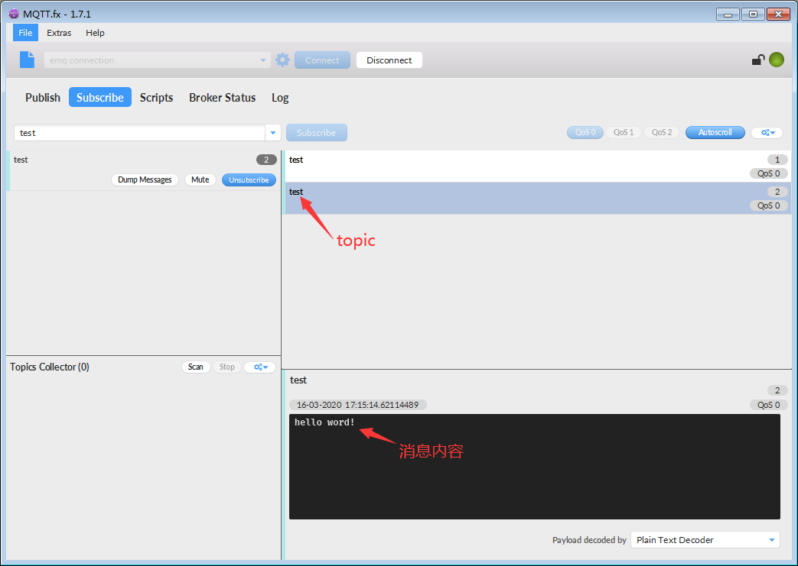  

## 模拟平台读取设备属性

1. 设备（MQTT.fx）订阅平台读取设备属性的topic。  

    i.  在MQTT.fx上，单击Subscribe。  

    ii. 输入平台获取设备属性的topic`/read-property`。  

    iii.  点击击Subscribe。  


2. 平台发送设备属性读取操作
   
   i. 单击设备实例页面中`MQTT_FX_Client`设备对应的`查看`链接，选择`运行状态`。
   
   ii. 单击属性刷新。
  
   iii. 订阅topic: `/read-property`对应的消息
        
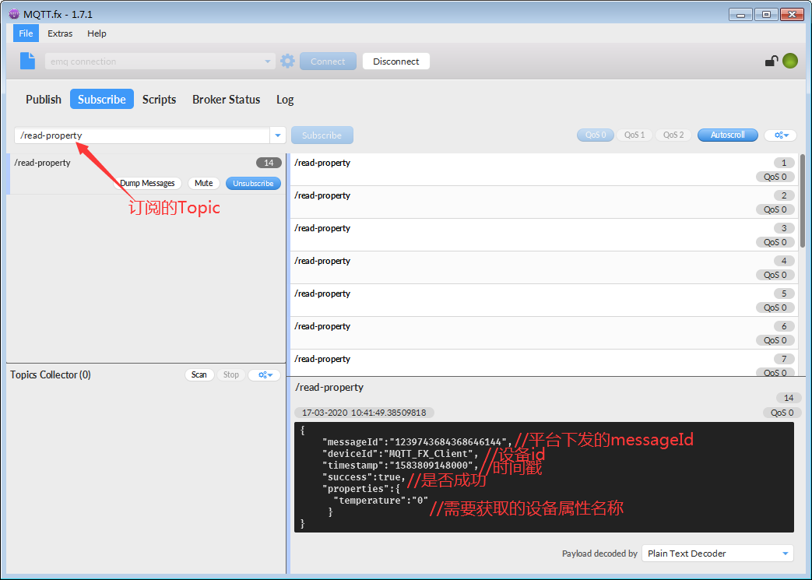
        
::: tip 注意:
   复制订阅该topic收到的消息中的messageId。此messageId将作为回复与平台设备属性的凭据之一
::: 

3. 设备（MQTT.fx）回复平台设备属性值  
    i.  在MQTT.fx上，单击 `Publish`。
    
    ii.  输入一个回复平台属性值消息Topic和要发送的消息内容，单击Publish，向平台推送该消息。
    
    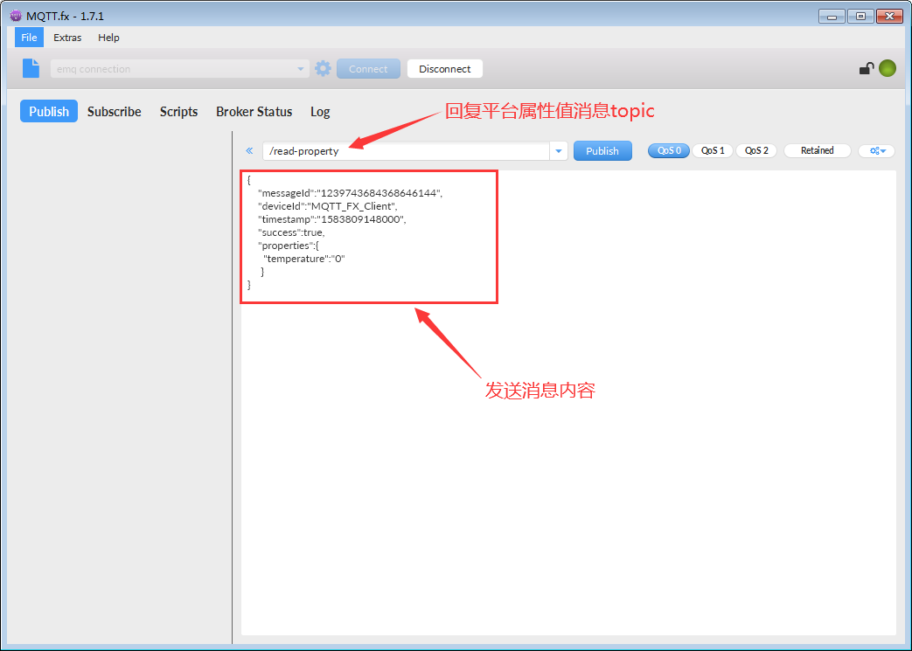
    
    | 参数         | 说明    |
    | :-----   | :-----  |
    | messageId       | 第一步订阅平台topic“/read-property”所收到的messageId值   |
    | deviceId        |   设备Id   |
    | timestamp        |   当前时间戳   |
    | success        |   成功标识   |
    | properties        |   设备属性值对象。例如： { "temperature":"50"}   |
    
    该文档所使用的回复内容
    
    ```json
    {
        "messageId":"第一步订阅平台topic“/read-property”所收到的messageId值",
        "deviceId":"MQTT_FX_Client",
        "timestamp":"1584417135000",
        "success":true,
        "properties":{
          "temperature":"50"
         }
    }
    ```
    
    iii. 平台收到Mqtt.fx推送的属性值
    
    
    
    iv. 读取设备属性回复的日志
    
    

## 模拟设备上报事件

1.在MQTT.fx上，单击 `Publish`。  

2.输入事件上报Topic和要发送的事件内容，单击Publish按钮，向平台推送该事件消息。

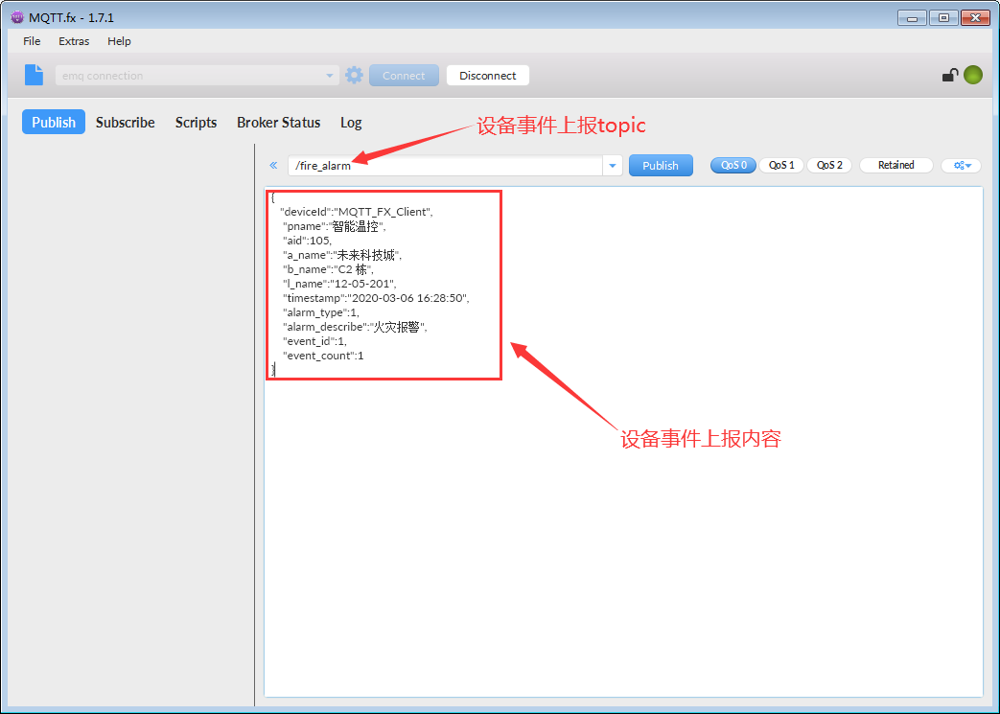

该文档使用的topic: `/fire_alarm`

该文档所使用的回复内容

```json
{
   "deviceId":"MQTT_FX_Client",
    "pname":"智能温控",
    "aid":105,
    "a_name":"未来科技城",
    "b_name":"C2 栋",
    "l_name":"12-05-201",
    "timestamp":"2020-03-06 16:28:50",
    "alarm_type":1,
    "alarm_describe":"火灾报警",
    "event_id":1,
    "event_count":1
}
```

| 参数         | 说明    |
| :-----   | :-----  |
| deviceId       | 设备Id   |
| pname        |   设备型号名称   |
| aid        |   区域Id   |
| a_name        |   区域名称   |
| b_name        |   建筑名称   |
| l_name        |   位置名称   |
| timestamp        |   上报时间   |
| alarm_type        |   报警类型   |
| alarm_describe        |   报警描述   |
| event_id        |   事件 ID   |
| event_count        |   该事件上报次数   |

3.事件上报设备日志


4.事件上报内容

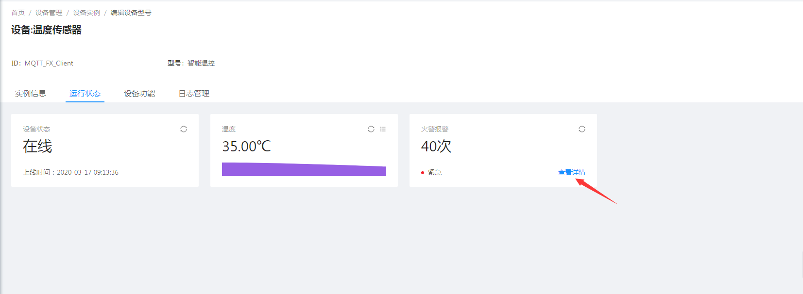
