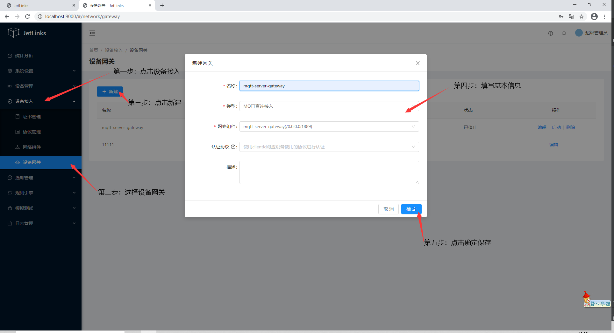

# 启动MQTT服务设备网关,接收设备消息

创建MQTT服务设备网关,用于直连设备、处理设备消息。

## 一. 启动MQTT服务

进入系统: `网络组件`-`组件管理` 点击左侧菜单中的`MQTT服务` 添加一个MQTT服务.

点击状态列中的`已停止`开启服务. 状态变为`已启动`则为启动完成.

## 测试连接

1. 点击表格中的`操作`-`调试`.
2. 点击调试界面中的`开始`按钮.
3. 使用[MQTT.fx](http://mqttfx.org/)软件进行连接测试.

在调试MQTT服务界面打印出相关连接消息则表示服务正常.

注意:

1. 一定要先在调试界面中点击开始.否则会拒绝MQTT连接.
2. 在没有配置网关服务前,mqtt客户端的`clientId`,`username`,`password`可以填写任意字符,但是不能留空.

## 创建设备网关

1. 新建设备网关配置:

2. 启动网关:

点击`操作`列中的`启动`按钮,启动网关.

网关状态说明:

1. 停止:网关完全停止.不再接受设备连接,以及消息.重新启动后只会接受最新的连接以及消息.
2. 暂停:网关不再接受新的设备连接,以及消息.重新启动后恢复处理之前的所有连接的消息.
3. 启动:网关处理新的设备连接以及消息.

## 设备连接

参照[使用自定义消息协议接入设备](device-connection.md)进行设备配置,注册,以及连接,消息收发测试.