# 设备管理
用于统一管理设备,设备建模,安全配置等操作

## 产品

### 什么是产品

产品是一个JSON格式的文件。它是物理空间中的实体，如传感器、车载装置、楼宇、工厂等在云端的数字化表示，从属性、功能和事件三个维度，分别描述了该实体是什么，能做什么，可以对外提供哪些信息。定义了这三个维度，即完成了产品功能的定义。

产品将产品功能类型分为三类：属性、功能、和事件。定义了这三类功能，即完成了产品的定义。

| 功能类型 | 说明 |
| :--------------: | ------------- |
| 属性（Properties）  | 一般用于描述设备运行时的状态，如环境监测设备所读取的当前环境温度等。属性支持GET和SET请求方式。应用系统可发起对属性的读取和设置请求。|
| 功能（Functions） | 设备可被外部调用的能力或方法，可设置输入参数和输出参数。相比于属性，功能可通过一条指令实现更复杂的业务逻辑，如执行某项特定的任务。|
| 事件（Event） | 设备运行时的事件。事件一般包含需要被外部感知和处理的通知信息，可包含多个输出参数。如，某项任务完成的信息，或者设备发生故障或告警时的温度等，事件可以被订阅和推送。|

### 产品数据格式
您可以在产品的物模型中编辑的属性、功能、事件、标签。

产品的属性、功能、事件JSON字段结构如下：
```json
{
    "properties":[
        {
            "id":"标识",
            "name":"属性名称",
            "valueType":{
                "min":"参数最小值（int、float、double类型特有）",
                "max":"参数最大值（int、float、double类型特有）",
                "step":"步长，字符串类型",
                "unit":"属性单位",
                "expands":{},//扩展属性
                "type":"属性类型: int（原生）、float（原生）、double（原生）、text（原生）、date（默认String类型UTC毫秒,可以自定义）、bool（0或1的int类型）、enum（int类型）、object（结构体类型，可包含前面6种类型）、array（数组类型，支持int/double/float/String）、file（文件，支持URL[地址]/base64[base64编码]/binary[二进制]）、password（密码）"
            },
            "expands":{
                "readOnly":"是否只读(true/false)",
                "report":"设备是否上报(true/false)"
            },
            "description":"说明"
        }
    ],
    "functions":[
        {
            "id":"标识",
            "name":"功能名称",
            "inputs":[//输入参数
                {
                    "id":"输入参数标识",
                    "name":"输入参数名称",
                    "valueType":{
                        "min":"参数最小值（int、float、double类型特有）",
                        "max":"参数最大值（int、float、double类型特有）",
                        "step":"步长，字符串类型",
                        "unit":"属性单位",
                        "type":"属性类型: int（原生）、float（原生）、double（原生）、text（原生）、date（默认String类型UTC毫秒,可以自定义）、bool（0或1的int类型）、enum（int类型）、object（结构体类型，可包含前面6种类型）、array（数组类型，支持int/double/float/String）、file（文件，支持URL[地址]/base64[base64编码]/binary[二进制]）、password（密码）"
                    }
                }
            ],
            "outputs":{//输出参数
                "min":"参数最小值（int、float、double类型特有）",
                "max":"参数最大值（int、float、double类型特有）",
                "step":"步长，字符串类型",
                "unit":"属性单位",
                "type":"属性类型: int（原生）、float（原生）、double（原生）、text（原生）、date（默认String类型UTC毫秒,可以自定义）、bool（0或1的int类型）、enum（int类型）、object（结构体类型，可包含前面6种类型）、array（数组类型，支持int/double/float/String）、file（文件，支持URL[地址]/base64[base64编码]/binary[二进制]）、password（密码）"
            },
            "isAsync":"是否异步(true/false)",
            "description":"说明"
        }
    ],
    "events":[
        {
            "id":"标识",
            "name":"事件名称",
            "valueType":{
                "min":"参数最小值（int、float、double类型特有）",
                "max":"参数最大值（int、float、double类型特有）",
                "step":"步长，字符串类型",
                "unit":"属性单位",
                "type":"属性类型: int（原生）、float（原生）、double（原生）、text（原生）、date（默认String类型UTC毫秒,可以自定义）、bool（0或1的int类型）、enum（枚举）、object（结构体类型，可包含前面6种类型）、array（数组类型，支持int/double/float/String）、file（文件，支持URL[地址]/base64[base64编码]/binary[二进制]）、password（密码）"
            },
            "expands":{
                "level":"事件级别(普通[ordinary]/警告[warn]/紧急[urgent])",
                "eventType":"事件类型(数据上报[reportData]/事件上报[reportEvent])"
            },
            "description":"说明"
        }
    ]
}
```
所有数据类型对应的valueType的JSON结构如下：
```json
{
    " int（原生）、float（原生）、double（原生）":{
          "min":"参数最小值（int、float、double类型特有）",
          "max":"参数最大值（int、float、double类型特有）",
          "step":"步长，字符串类型",
          "unit":"属性单位",
          "type":"属性类型: int（原生）、float（原生）、double（原生）、text（原生）"
    },
    "date":{
    	"dateFormat":"时间格式",
    	"type":"date"
    },
	"bool":{
		"trueValue":"true值，可自定义",
		"trueText":"trueText值，可自定义",
		"falseValue":"false值，可自定义",
		"falseText":"falseText值，可自定义",
		"type":"boolean"
	},
	"enum":{
        "elements":[
            {
                "value":"1",
                "key":"在线"
            },{
                "value":"0",
                "key":"离线"
            }
        ],
        "type":"enum"
    },
    "text":{
        "expands":{
            "maxLength":"最大长度"
        },
        "type":"string"
    },
    "object":{
        "properties":[//其它类型结构跟类型结构与外部属性的结构一致
        {
            "id":"标识",
            "name":"名称",
            "valueType":{
                "min":"最小值",
                "max":"最大值",
                "step":"步长",
                "unit":"单位",
                "type":"数据类型"
            },
                "description":"备注"
            }
        ],
        "type":"object"
    },
    "array":{
        "elementType":{
            "type":"object",
            "properties":[//其它类型结构跟类型结构与外部属性的结构一致
                {
                    "id":"标识",
                    "name":"名称",
                    "valueType":{
                        "min":"最小值",
                        "max":"最大值",
                        "step":"步长",
                        "unit":"单位",
                        "type":"类型"
                    },
                    "description":"备注"
                }
            ]
        },
        "expands":{
            "elementNumber":"元素个数"
        },
        "type":"array"
    },
    "file":{
        "bodyType":"文件元素类型",
        "type":"file"
    },
    "password":{
        "type":"password"
    }
}
```

### 添加产品

1. 登录物联网管理平台。
2. 在左侧导航栏，选择设备管理 > 产品。
3. 在产品管理页面产品列表中，单击产品所对应的`新建型号`操作按钮。
4. 在弹出对话框中，选择型号信息选项卡，然后填写产品所对应的属性数据并选择产品所对应的消息协议、连接协议，选择完成后对话框下方将显示不同协议所对应的配置信息。

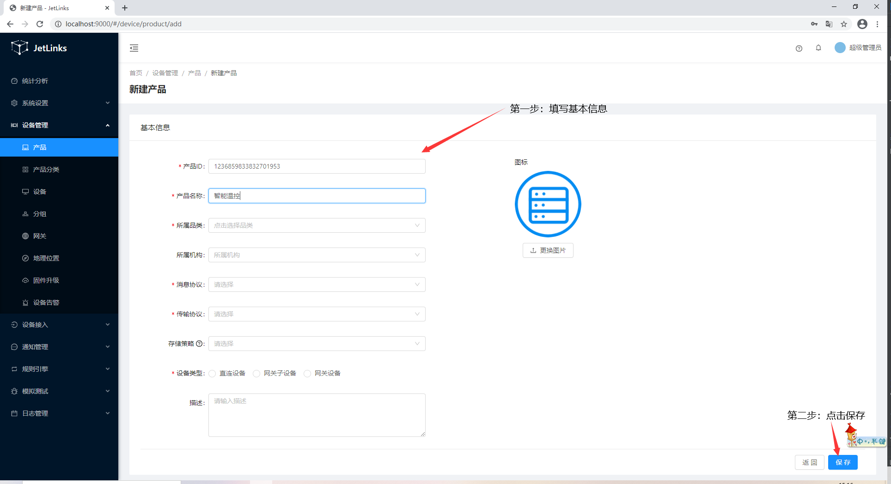

| 参数 | 描述 |
| :--------------: | -------------|
| 型号ID      |唯一标识符，在属性中具有唯一性。可包含英文、数字、下划线，长度不超过32个字符，例如PowerComsuption。`不填写将由系统自动生成`。|
| 型号名称      |为型号命名。例如，test。支持中文、英文字母、数字、下划线（_）、连接号（-）、@符号和英文圆括号，长度限制4~30，一个中文汉字算2位。|
| 分类目录      |为产品分类，能更方便的管理产品。类似于分组。|
| 所属机构      |设备所属的机构，一个平台存在多个部门同时操作，能保证用户操作的产品是自己所在的机构下的产品。|
| 消息协议      |不同厂商不同的设备所用的消息传输协议不同，平台定义好消息协议后平台将根据所设定的消息协议格式进行解析设备所上报的数据。|
| 连接协议      |1. MQTT：MQTT是一个基于客户端-服务器的消息发布/订阅传输协议。MQTT协议是轻量、简单、开放和易于实现的，这些特点使它适用范围非常广泛。在很多情况下，包括受限的环境中，其在，通过卫星链路通信传感器、偶尔拨号的医疗设备、智能家居、及一些小型化设备中已广泛使用。<br>2. MQTT TLS：MQTT使用UDP上的数据报TLS协议来进行加密。<br>3. CoAP：Coap（Constrained Application Protocol）是一种在物联网世界的类web协议，它的详细规范定义在 RFC 7252。COAP名字翻译来就是“受限应用协议”，顾名思义，使用在资源受限的物联网设备上。物联网设备的ram，rom都通常非常小，运行TCP和HTTP是不可以接受的。<br>4. CoAP DTLS：CoAP使用UDP上的数据报TLS协议（DTLS）来进行加密。|
| 设备类型      |标识该型号所属的设备类型。|
| 说明      | 输入文字，对该属性进行说明或备注。长度限制为100字。|
| 扩展描述      | 选择消息协议和连接协议过后会有其他配置信息显示，设备注册时将携带配置中的参数及数据，平台验证上报数据中所传的数据是否正确。|

5. 选择设备定义选项卡。
    + 自定义属性：在属性定义表格右上角有个添加按钮，点击按钮将弹出会话框。设置参数完成后，单击`保存`。

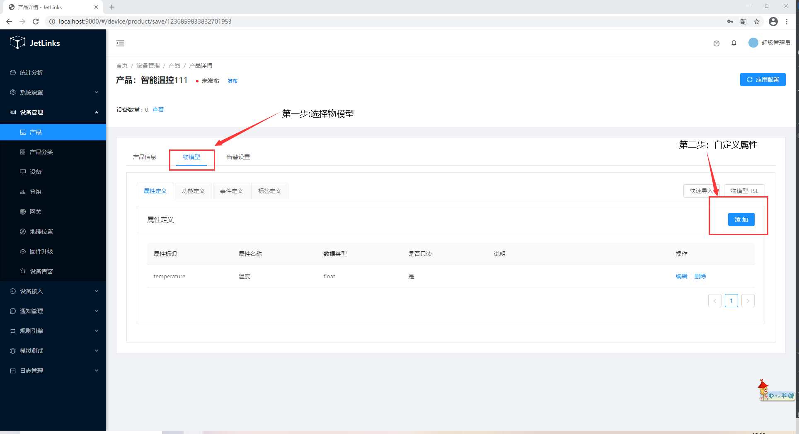  


属性参数设置说明如下表。

| 参数 | 描述 |
| :--------------: | ------------- |
| 属性标识      |唯一标识符，在属性中具有唯一性。即Jetlinks JSON格式中的id的值，作为设备上报该属性数据的Key，平台根据该标识符校验是否接收数据。可包含英文、数字、下划线，长度不超过32个字符，例如PowerComsuption。|
| 属性名称      | 属性的名称，例如网关SN。支持中文、大小写字母、数字、短划线和下划线，且必须以中文、英文或数字开头，不超过32个字符。|
| 数据类型      |1. int32：32位整型。需定义取值范围、步长和单位符号。<br>2. float：单精度浮点型。需定义取值范围、步长和单位符号。<br>3. double：双精度浮点型。需定义取值范围、步长和单位符号。<br>4. enum：枚举型。定义枚举项的参数值和参数描述，例如1-加热模式、2-制冷模式等。<br>5. bool：布尔型。采用0或1来定义布尔值，例如0-关；1-开。<br>6. text：字符串。需定义字符串的数据长度，最长支持2048字节。<br>7. date：时间戳。默认格式为String类型的UTC时间戳，单位：毫秒。`可自定义格式`，例如yyyy-MM-dd。<br>8. object：JSON对象。定义一个JSON结构体，新增JSON参数项，例如定义灯的颜色是由Red、Green、Blue三个参数组成的结构体。 `miniui版本不支持结构体嵌套`。<br>9. array：数组。需声明数组内元素的数据类型，可选择int32、float、double、text或object。需确保同一个数组元素类型相同。数组内可包含1-128个元素。<br>10. file：文件。需声明文件元素类型，可选择URL、base64、binary(二进制)。<br>11. password：密码。上报时如果属性为密码将进行加密或者是隐秘的方式进行显现或者处理。<br>`备注：出参类型为object添加JSON对象。为array时选择元素类型，如果元素类型为object，添加JSON对象。填写元素个数。`|
| 步长      | 属性值和事件以及功能中输入输出参数值变化的最小粒度。数据类型为int32、float、double时，需要根据您的业务需要设置步长。例如为温度计产品定义温度属性时，将数据类型设置为int32，步长为2，单位为℃，取值范围0~100。即温度每变化两度，设备上报温度值，例如0℃、2℃、4℃、6℃、8℃……。|
| 单位      | 单位可选择为无或根据实际情况选择。|
| 是否只读      | 读写：请求读写的方法支持GET（获取）和SET（设置）。<br>只读：请求只读的方法仅支持GET（获取）。|
| 设备上报      | 设备运行时上报数据中，是否包含此属性，设置 `是`时设备上报就会携带此属性，设置 `否`时设备上报就不会携带此属性。|
| 说明      | 输入文字，对该属性进行说明或备注。长度限制为100字。|

   + 自定义功能：在功能定义表格右上角有个添加按钮，点击按钮将弹出会话框。设置参数完成后，单击`确认`。
   
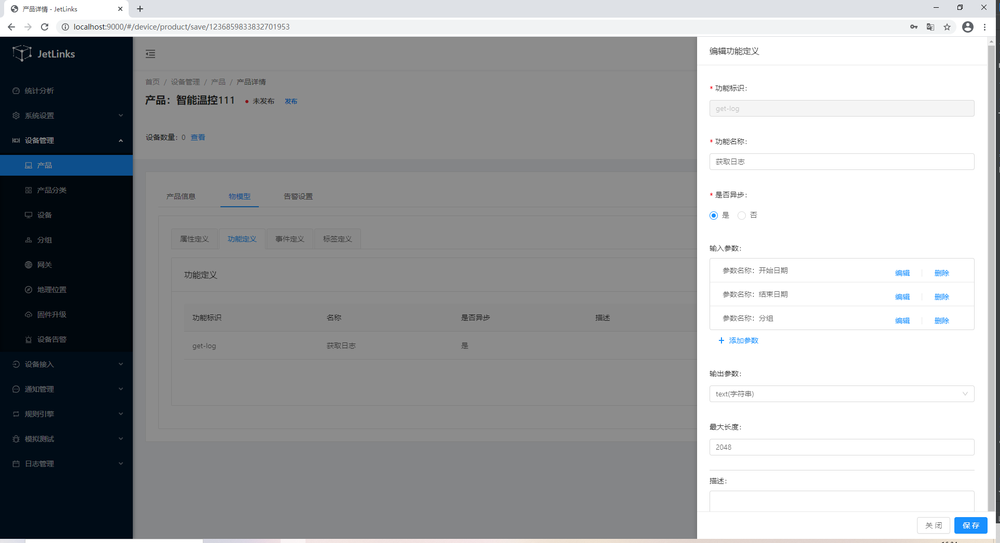

功能参数设置说明如下表。

| 参数 | 描述 |
| :--------------: | ------------- |
| 功能标识      |唯一标识符，在功能中具有唯一性。即Jetlinks JSON格式中的id的值，作为设备上报该属性数据的Key，平台根据该标识符校验是否接收数据。可包含英文、数字、下划线，长度不超过32个字符，例如PowerComsuption。|
| 功能名称      | 功能的名称，例如CPU使用率。支持中文、大小写字母、数字、短划线和下划线，且必须以中文、英文或数字开头，不超过32个字符。|
| 是否异步      | 异步：服务为异步调用时，云端执行调用后直接返回结果，不会等待设备的回复消息。<br>同步：服务为同步调用时，云端会等待设备回复；若设备没有回复，则调用超时。|
| 输入参数      |设置该服务的入参，可选。<br>单击`添加参数`，在弹窗对话框中添加服务入参。|
| 出参类型      | 1. int32：32位整型。需定义取值范围、步长和单位符号。<br>2. float：单精度浮点型。需定义取值范围、步长和单位符号。<br>3. double：双精度浮点型。需定义取值范围、步长和单位符号。<br>4. enum：枚举型。定义枚举项的参数值和参数描述，例如1-加热模式、2-制冷模式等。<br>5. bool：布尔型。采用0或1来定义布尔值，例如0-关；1-开。<br>6. text：字符串。需定义字符串的数据长度，最长支持2048字节。<br>7. date：时间戳。默认格式为String类型的UTC时间戳，单位：毫秒。`可自定义格式`，例如yyyy-MM-dd。<br>8. object：JSON对象。定义一个JSON结构体，新增JSON参数项，例如定义灯的颜色是由Red、Green、Blue三个参数组成的结构体。 `miniui版本不支持结构体嵌套`。<br>9. array：数组。需声明数组内元素的数据类型，可选择int32、float、double、text或object。需确保同一个数组元素类型相同。数组内可包含1-128个元素。<br>10. file：文件。需声明文件元素类型，可选择URL、base64、binary(二进制)。<br>11. password：密码。上报时如果属性为密码将进行加密或者是隐秘的方式进行显现或者处理。<br>`备注：出参类型为object添加JSON对象。为array时选择元素类型，如果元素类型为object，添加JSON对象。填写元素个数。`|
| 说明      | 输入文字，对该功能进行说明或备注。长度限制为100字。|

   + 自定义事件：在事件定义表格右上角有个添加按钮，点击按钮将弹出会话框。设置参数完成后，单击`确认`。


事件参数设置说明如下表。

| 参数 | 描述 |
| :--------------: | ------------- |
| 事件标识      |唯一标识符，在事件中具有唯一性。即Jetlinks JSON格式中的id的值，作为设备上报该属性数据的Key，平台根据该标识符校验是否接收数据。可包含英文、数字、下划线，长度不超过32个字符，例如PowerComsuption。|
| 事件名称      | 事件的名称，例如用电量数据上报。支持中文、大小写字母、数字、短划线和下划线，且必须以中文、英文或数字开头，不超过32个字符。|
| 事件类型      | 数据上报：指设备监测到某些数值的改变时上传改变后的数值，例如温度计监测到温度变化。<br>事件上报：事件监控功能为您提供上报自定义事件的接口，方便您将业务产生的异常事件采集上报到云监控，通过对上报的事件配置报警规则来接收报警通知。|
| 事件级别      |普通：指设备上报的一般性通知，例如完成某项任务等。<br>告警：设备运行过程中主动上报的突发或异常情况，告警类信息，优先级高。您可以针对不同的事件类型进行业务逻辑处理和统计分析。<br>故障：设备运行过程中主动上报的突发或异常情况，故障类信息，优先级高。您可以针对不同的事件类型进行业务逻辑处理和统计分析。|
| 出参类型      | 1. int32：32位整型。需定义取值范围、步长和单位符号。<br>2. float：单精度浮点型。需定义取值范围、步长和单位符号。<br>3. double：双精度浮点型。需定义取值范围、步长和单位符号。<br>4. enum：枚举型。定义枚举项的参数值和参数描述，例如1-加热模式、2-制冷模式等。<br>5. bool：布尔型。采用0或1来定义布尔值，例如0-关；1-开。<br>6. text：字符串。需定义字符串的数据长度，最长支持2048字节。<br>7. date：时间戳。默认格式为String类型的UTC时间戳，单位：毫秒。`可自定义格式`，例如yyyy-MM-dd。<br>8. object：JSON对象。定义一个JSON结构体，新增JSON参数项，例如定义灯的颜色是由Red、Green、Blue三个参数组成的结构体。 `miniui版本不支持结构体嵌套`。<br>9. array：数组。需声明数组内元素的数据类型，可选择int32、float、double、text或object。需确保同一个数组元素类型相同。数组内可包含1-128个元素。<br>10. file：文件。需声明文件元素类型，可选择URL、base64、binary(二进制)。<br>11. password：密码。上报时如果属性为密码将进行加密或者是隐秘的方式进行显现或者处理。<br>`备注：出参类型为object添加JSON对象。为array时选择元素类型，如果元素类型为object，添加JSON对象。填写元素个数。`|
| 说明      | 输入文字，对该事件进行说明或备注。长度限制为100字。|

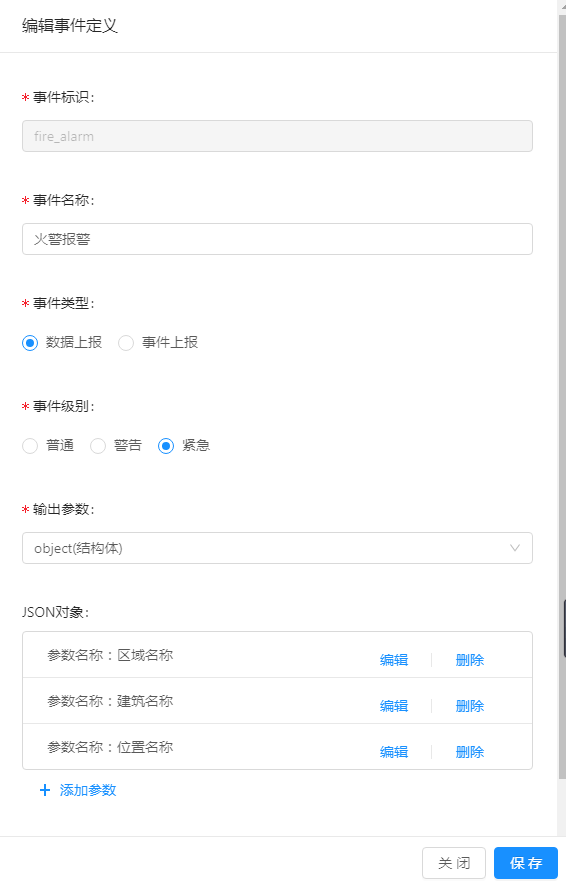

JSON对象参数设置说明如下表。

| 参数 | 描述 |
| :--------------: | ------------- |
| 参数标识      |唯一标识符，在JSON对象中具有唯一性。即Jetlinks JSON格式中的id的值，作为设备上报该属性数据的Key，平台根据该标识符校验是否接收数据。可包含英文、数字、下划线，长度不超过32个字符，例如PowerComsuption。|
| 参数名称      | 参数的名称，例如SN。支持中文、大小写字母、数字、短划线和下划线，且必须以中文、英文或数字开头，不超过32个字符。|
| 数据类型      | 1. int32：32位整型。需定义取值范围、步长和单位符号。<br>2. float：单精度浮点型。需定义取值范围、步长和单位符号。<br>3. double：双精度浮点型。需定义取值范围、步长和单位符号。<br>4. enum：枚举型。定义枚举项的参数值和参数描述，例如1-加热模式、2-制冷模式等。<br>5. bool：布尔型。采用0或1来定义布尔值，例如0-关；1-开。<br>6. text：字符串。需定义字符串的数据长度，最长支持2048字节。<br>7. date：时间戳。默认格式为String类型的UTC时间戳，单位：毫秒。`可自定义格式`，例如yyyy-MM-dd。<br>8. file：文件。需声明文件元素类型，可选择URL、base64、binary(二进制)。<br>9. password：密码。上报时如果属性为密码将进行加密或者是隐秘的方式进行显现或者处理。<br>`备注：object和array类型miniui暂不支持。`|
| 说明      | 输入文字，对该事件进行说明或备注。长度限制为100字。|

6. 所有信息以及属性、功能、事件全部补充完成后单击单击`保存`即可。

#### 后续操作步骤

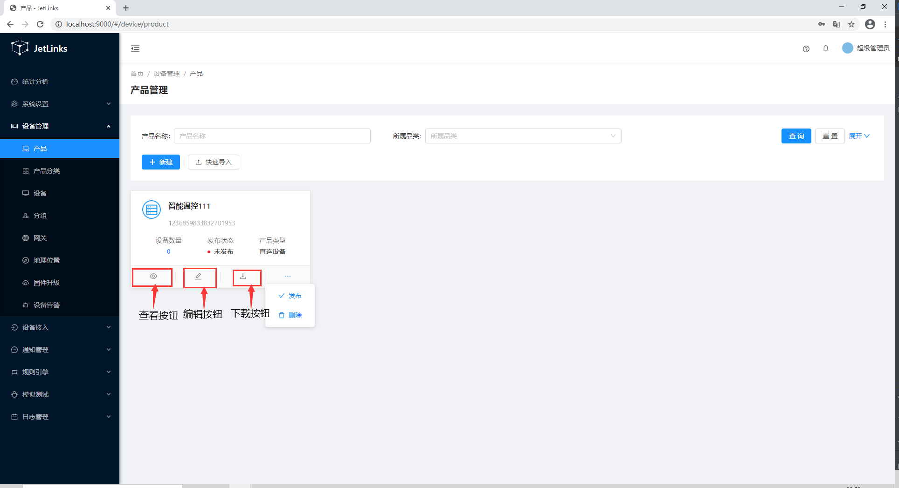

1. 在产品列表中单击该型号的`编辑`按钮，可以修改基本信息或者是定义的属性、功能、事件。
2. 在产品列表中单击该型号的`发布`按钮，将该产品注册到注册中心，添加设备时将会查询到该产品。
   + 产品发布后,状态将变为`已发布`状态，已发布的产品或者是已绑定设备的产品将不支持删除。
3. 在产品列表中单击该型号的`删除`按钮，将物理删除该产品。
   + `已发布`状态的产品将不显示`删除`按钮。
   + 取消发布后如果产品已关联设备，点击`删除`按钮时将提示：`删除失败:该型号已绑定实例,无法删除`。
4. 在产品列表中单击该型号的`下载配置`按钮，可以将该产品的配置信息导出成一个json文件，文件内容为JSONString形式保存。
5. 在产品列表中单击该型号的`导入配置`按钮，可以将导出的产品配置json文件导入至平台内，如果平台内存在相同ID主键的型号将会去修改相同主键的产品信息，反之就在平台内新增一条新的产品信息。
6. 在产品列表中单击该型号的`导出配置`按钮，将导出所有产品配置信息导出成一个json文件，文件内容为JSONString形式保存，也可以根据查询条件进行查询导出，导出界面所见所得数据。

## 设备

### 添加设备

1. 登录物联网管理平台。
2. 在左侧导航栏，选择设备管理 > 设备。
3. 在设备管理页面设备列表中，单击设备所对应的`添加设备`操作按钮。
4. 在弹出对话框中，填写设备所需的基本信息即可。设置参数完成后，单击`保存`。

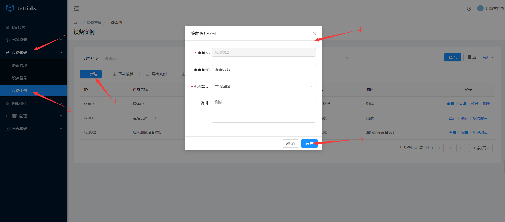

设备参数设置说明如下表。

| 参数 | 描述 |
| :--------------:  | ------------- |
| 设备ID      |唯一标识符，在设备中具有唯一性。可包含英文、数字、下划线，长度不超过32个字符，例如PowerComsuption。`不填写将由系统自动生成`|
| 设备名称      | 设备的名称，例如`XXX门锁`。支持中文、大小写字母、数字、短划线和下划线，且必须以中文、英文或数字开头，不超过32个字符。|
| 产品      | 产品中发布后的产品在此处就能选择。新创建的设备将继承该产品定义好的属性、功能、事件。|
| 所属机构      |设备所属的机构，一个平台存在多个部门同时操作，能保证用户操作的设备是自己所在的机构下的设备。|
| 说明      | 输入文字，对该事件进行说明或备注。长度限制为100字。|

#### 设备管理

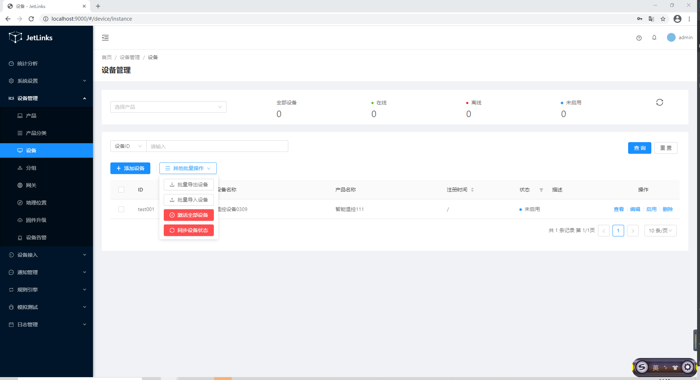

设备信息说明如下表。

| 参数 | 描述 |
| :--------------: | ------------- |
|搜索设备      | 输入设备名称、产品或设备状态搜索具体设备，支持模糊搜索。|
| 查看具体设备信息      | 单击对应设备的查看按钮。|
| 删除具体设备信息      | 单击对应设备的删除按钮。删除为物理删除，暂不支持逻辑删除<br>`备注：已激活设备不显示"删除"按钮`。|
| 编辑具体设备信息      | 单击对应设备的编辑按钮。|
| 激活具体设备      | 单击对应设备的编辑按钮。新增设备状态为`未激活`，点击`激活`按钮先将设备激活。激活后设备未在线将显示`离线`状态，操作按钮将显示`取消激活`。|
| 下载导入模板      | 设备支持批量导入，下载导入Excel表格模板。<br>`备注：暂只支持Excel表格`。|
| 批量导入设备      | 下载导出模板后在Excel表格内填写需要导入的设备的基本信息，然后点击界面`导入实例`按钮，选择填写好的Excel表格等待导入完成即可。|
| 激活全部设备      | 批量导入设备数量不可控，有可能几万或者更多，那么这些需要激活设备就只能通过`一键激活`的方式将设备进行激活。|
| 同步设备状态      | 同步列表中设备在设备注册中心中的状态到数据库。|

#### 设备信息

在设备列表中，单击设备对应的查看按钮，进入设备详情页。

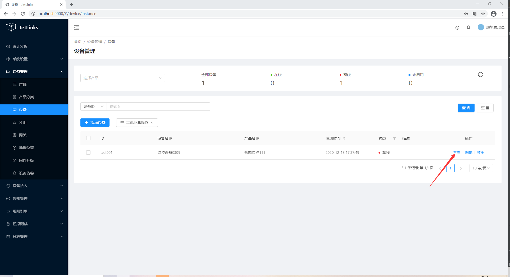


设备信息说明如下表。

| 参数 | 描述 |
| :--------------: | ------------- |
| 查看设备信息      |查看设备基本信息，包括产品信息、扩展信息、标签信息等内容。|
| 查看设备运行状态      | 在设备激活并上线后运行状态页签下，查看设备当前状态、产品配置的属性、事件等信息。<br>如果是事件可查看事件所上报的数据详情信息。|
| 查看设备日志      | 设备行为、上行消息、下行消息等消息内容，点击`详情内容`可查看具体日志的详细内容。|

设备信息说明如下表。

| 参数 | 描述 |
| :--------------: | ------------- |
| ID      |唯一标识符，在设备中具有唯一性，例如PowerComsuption。|
| 型号      | 设备的名称，例如`XXX门锁`。支持中文、大小写字母、数字、短划线和下划线，且必须以中文、英文或数字开头，不超过32个字符。|
| 状态      | 设备的当前状态。当前状态分为：未激活、在线、离线。|

设备关联产品以后,在设备查看页面也将显示产品信息，说明如下表。

| 参数 | 描述 |
| :--------------: | ------------- |
| 设备名称      | 产品中发布后的产品在此处就能选择。新创建的设备将继承该产品定义好的属性、功能、事件。|
| 分类目录      |为产品分类，能更方便的管理产品。类似于分组。|
| 消息协议      |不同厂商不同的设备所用的消息传输协议不同，平台定义好消息协议后平台将根据所设定的消息协议格式进行解析设备所上报的数据。|
| 连接协议      |1. MQTT：MQTT是一个基于客户端-服务器的消息发布/订阅传输协议。MQTT协议是轻量、简单、开放和易于实现的，这些特点使它适用范围非常广泛。在很多情况下，包括受限的环境中，其在通过卫星链路通信传感器、偶尔拨号的医疗设备、智能家居、及一些小型化设备中已广泛使用。<br>2. MQTT TLS：MQTT使用UDP上的数据报TLS协议来进行加密。<br>3. CoAP：Coap（Constrained Application Protocol）是一种在物联网世界的类web协议，它的详细规范定义在 RFC 7252。COAP名字翻译来就是“受限应用协议”，顾名思义，使用在资源受限的物联网设备上。物联网设备的ram，rom都通常非常小，运行TCP和HTTP是不可以接受的。<br>4. CoAP DTLS：CoAP使用UDP上的数据报TLS协议（DTLS）来进行加密。|
| 设备类型      |标识该型号所属的设备类型。|
| 描述      | 产品填写的说明或备注。|

#### 运行状态


1. 记录展示设备当前状态以及用户自定义的产品内的属于以及事件信息。
2. 展示设备上报事件的详情`不同设备类型配置的设备属性、事件不同所展示的内容都有所不同`。

#### 设备日志

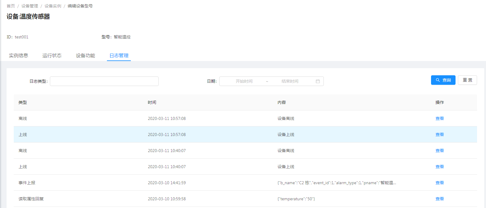

1. 展示设备行为、上行消息、下行消息等消息内容，点击`详情内容`可查看具体日志的详细内容。
2. 日志`详情内容`将显示设备行为、上行消息、下行消息等消息内容的详细内容。

## 分组

### 新建分组

[参考创建房间分组](../best-practices/rule-engine-device-same-group.md#创建房间分组)  

### 编辑

可对分组名称进行编辑。  

### 解绑所有设备

在相应分组上点击`解绑所有设备`按钮。  

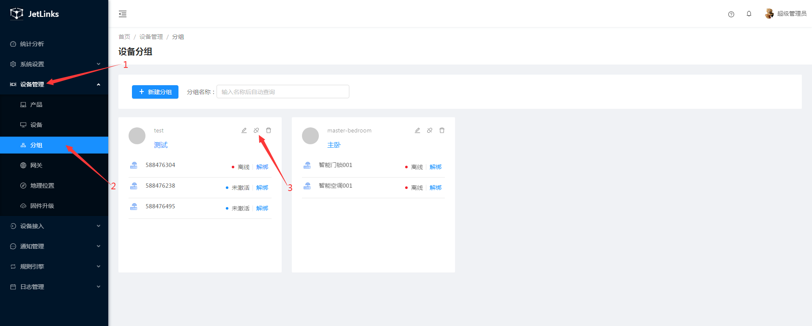  

### 删除

在相应分组上点击`删除`按钮即可删除分组。  

## 网关

## 地理位置


1. 物模型中添加地理位置。通过属性定义添加地理位置类型属性。
    
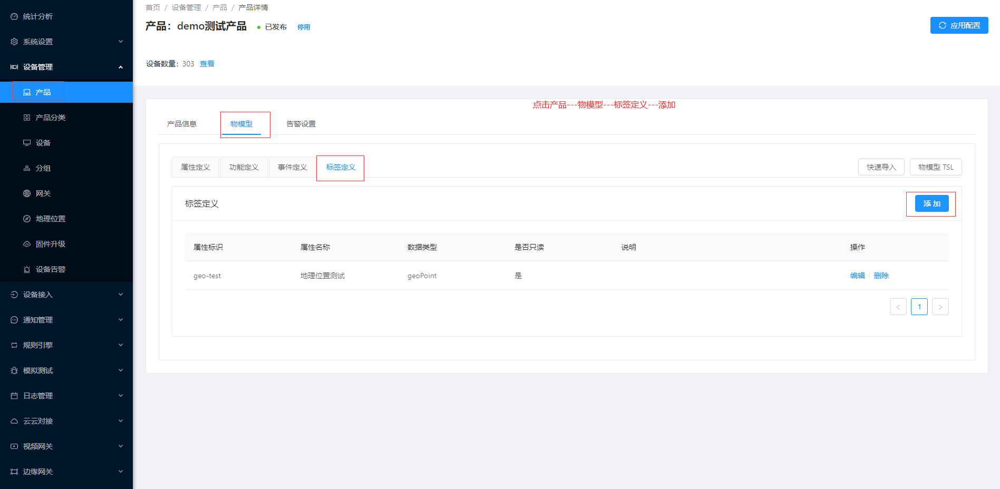  
     
2. 在设备产品详情页面点击`应用配置`按钮。  
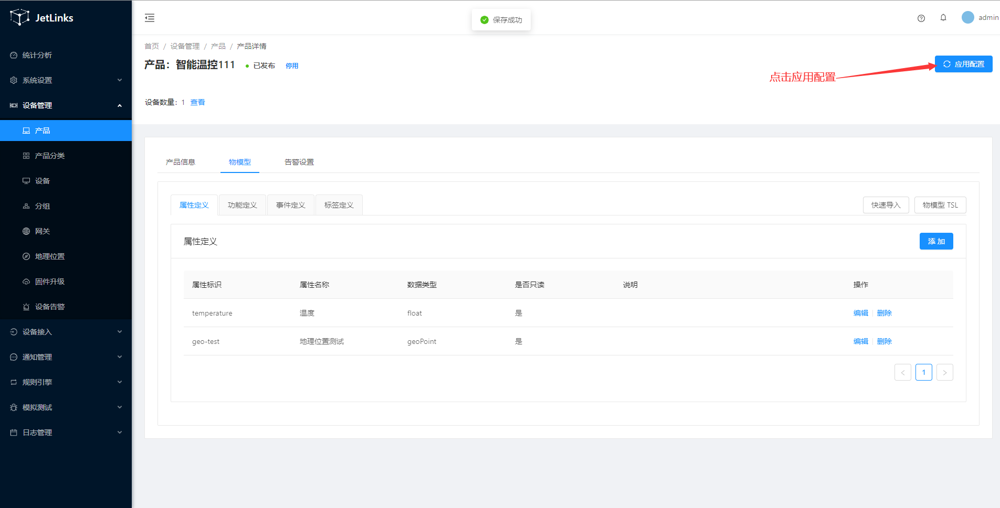  

3. 使用mqtt.fx连接到平台，设备上线后推送地理位置消息到平台， 此处使用topic为`/report-property`。  

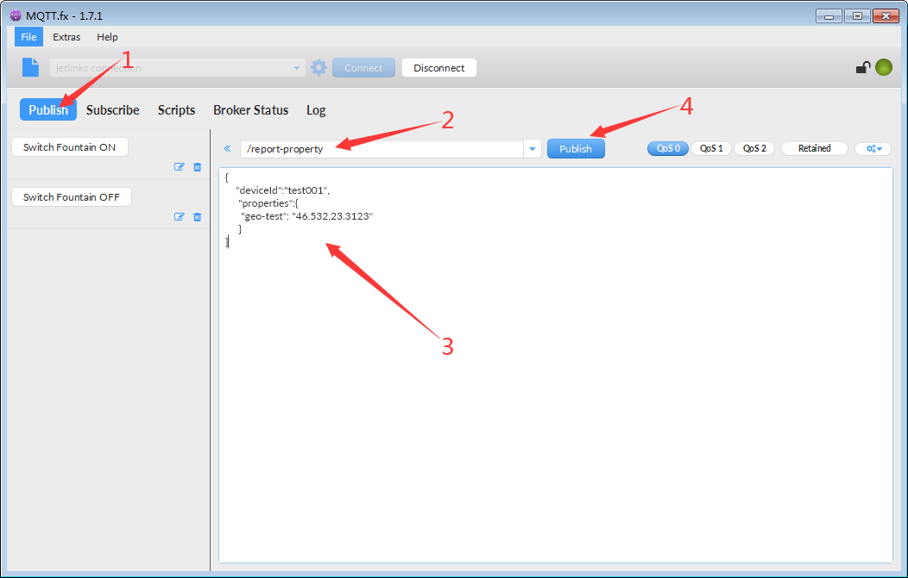  

## 固件升级

[参考设备固件管理](../dev-guide/device-firmware.md)
