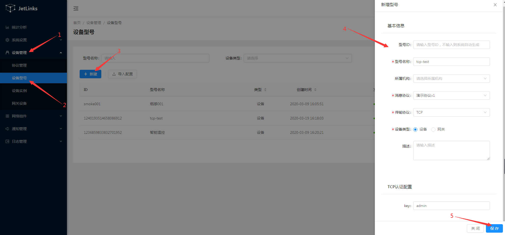
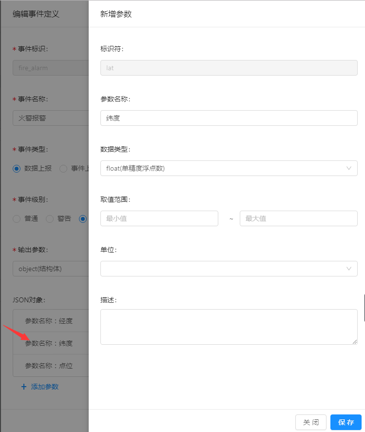
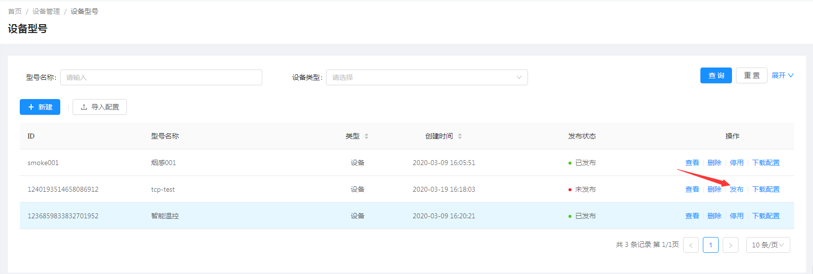
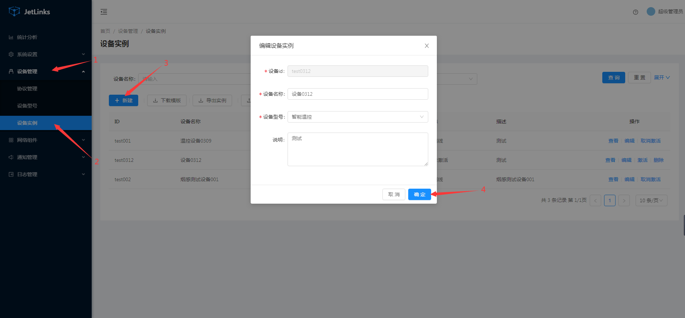
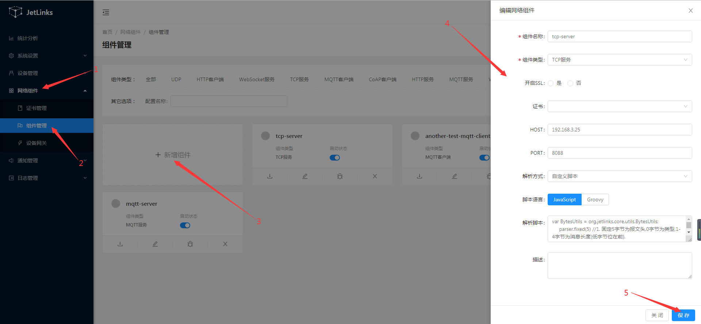
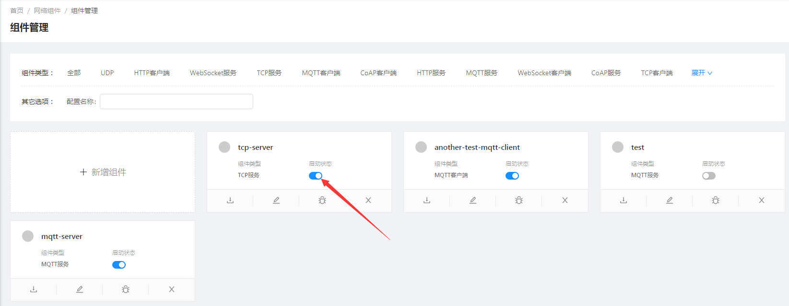
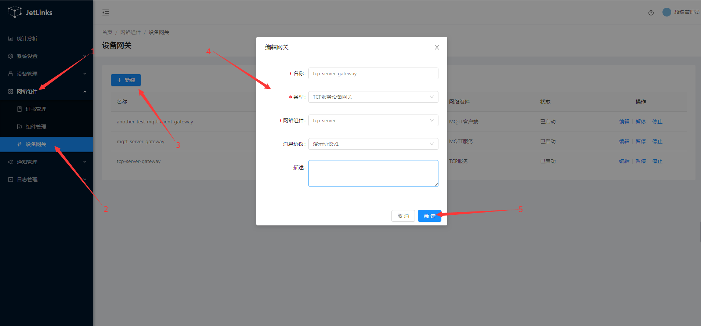
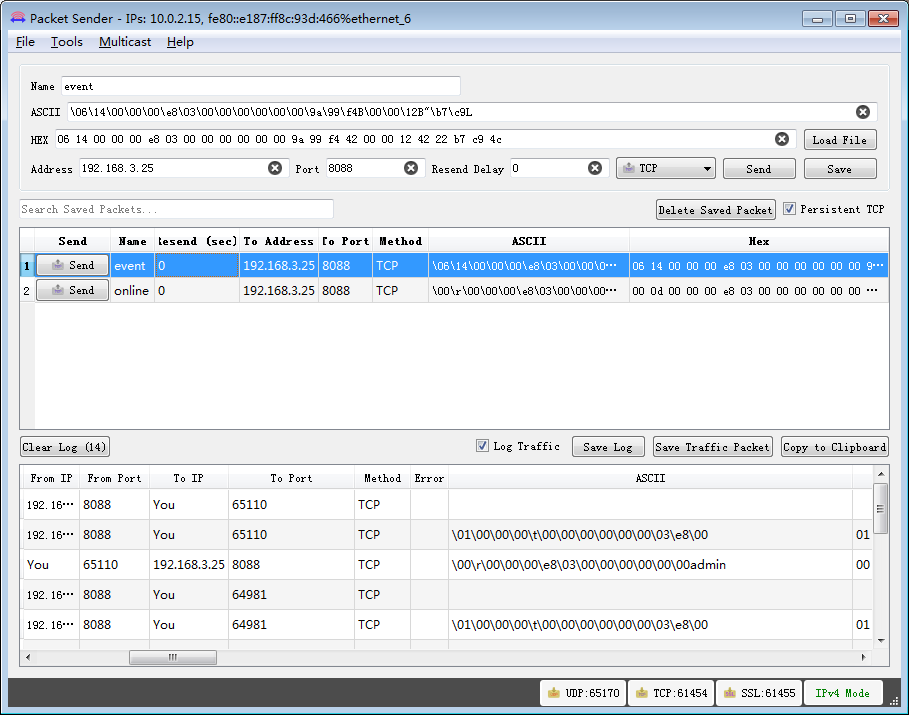

# 使用TCP服务网关接入设备
本文档使用[Packet Sender](https://packetsender.com/download#show)工具模拟tcp客户端接入平台。

## 创建协议

请参考[创建协议](../advancement-guide/mqtt-connection.md#创建协议)

## 创建设备型号

1. 选择 `设备管理`-->`设备型号`--> 点击`新建`按钮。  

  

2. 在操作列点击`查看`，选择功能定义，点击`添加`按钮添加属性和事件。  
    i. 属性定义  
      
    ii. 事件定义  
      
      
      
      
3. 在操作列点击`发布`按钮，发布新增的型号。  

  

## 创建设备实例

1. 选择 `设备管理`-->`设备实例`--> 点击`新建`按钮。  

  

2. 在操作列点击`激活`按钮，激活新增的设备实例。  

  

## 创建TCP服务网络组件

1. 选择 `网络组件`-->`组件管理`--> 点击`新增组件`按钮。  
  
::: tip 注意
本文档使用javascript自定义脚本的方式解析消息。
:::
自定义脚本：  
```js
var BytesUtils = org.jetlinks.core.utils.BytesUtils;
     parser.fixed(5) //1. 固定5字节为报文头,0字节为类型,1-4字节为消息长度(低字节位在前).
       .handler(function(buffer){
            var len = BytesUtils.leToInt(buffer.getBytes(),1,4);//2. 获取消息长度.
            parser
               .fixed(len)//3. 设置下一个包要读取固定长度的数据.
               .result(buffer); //4. 设置当前解析的结果
        })
       .handler(function(buffer){
            parser.result(buffer) //5. 收到了新的包,则为消息体,设置到结果中,完成后将与步骤4的数据合并为完整的数据包.
                   .complete(); //6. 完成解析(消息将进入协议中进行解析(DemoTcpMessageCodec)),重置解析器,下一个数据包将从步骤1开始解析.
        });
```
2. 在创建完成的模块上点击`启动`按钮。  
  

## 创建TCP服务设备网关

1. 选择 `网络组件`-->`设备网关`--> 点击`新建`按钮。
  
::: tip 注意
和MQTT服务设备网关不同的是,客户端必须指定消息协议,因为无法通过消息识别出对应的设备标识.
在消息解码时也无法通过上下文(`MessageDecodeContext`)获取到设备操作接口(`DeviceOperator`).
此处使用`演示协议v1`.
:::
2. 在操作列点击`启动`按钮启动网关。  
   

## 使用tcp工具接入

1. 下载并安装[Packet Sender](https://packetsender.com/download#show)。  

::: tip 注意
TCP协议以二进制的数据包传输数据，此处使用Packet Sender工具将发送的消息先转成十六进制，
再通过该工具自动转换成二进制发送到平台。
:::

2. 生成所需的十六进制字符串。  
    i. 检出[协议代码](https://github.com/jetlinks/demo-protocol.git)  
    ii. 执行测试包org.jetlinks.demo.protocol.tcp下DemoTcpMessageTest的test方法生成设备认证所需的十六进制字符串  
    代码如下：  
```java
    @Test
    void test() {
        DemoTcpMessage message = DemoTcpMessage.of(MessageType.AUTH_REQ, AuthRequest.of(1000, "admin"));

        byte[] data = message.toBytes();
        System.out.println(Hex.encodeHexString(data));

        DemoTcpMessage decode = DemoTcpMessage.of(data);

        System.out.println(decode);

        Assertions.assertEquals(message.getType(), decode.getType());
        Assertions.assertArrayEquals(message.getData().toBytes(), decode.getData().toBytes());
    }
   
```
结果：`000d000000e80300000000000061646d696e`
  
::: tip 注意
AuthRequest.of(deviceId,key) 第一个参数为设备id，第二参数为设备型号中配置的TCP认证配置。  
:::   
    
   iii. 在测试类中执行如下代码生成事件上报所需的十六进制字符串：  
    
```java
    @Test
    void encodeEvent() {
        DemoTcpMessage demoTcpMessage = DemoTcpMessage.of(MessageType.FIRE_ALARM,
                FireAlarm.builder()
                        .point(ThreadLocalRandom.current().nextInt())
                        .lat(36.5F)
                        .lnt(122.3F)
                        .deviceId(1000)
                        .build());
        byte[] data = demoTcpMessage.toBytes();
        System.out.println(demoTcpMessage);
        System.out.println(Hex.encodeHexString(data));
    }
```  
结果：`0614000000e8030000000000009a99f4420000124222b7c94c`

3. 设置参数

    i. 设置基本信息
      
    
   | 参数         | 说明    |
    | :-----   | :-----  |
    | Name       | 输入您的自定义名称。   |
    | ASCII        |   ASCII码，输入下方十六进制字符串后会自动生成。   |、
    | HEX        |   十六进制。   |
    | Address        |   TCP服务地址。   |
    | Port        |   TCP服务端口。   |
    | Persistent TCP        |   勾选之后可保持长连接。   |
    
    ::: tip 注意
    设置参数时，请确保参数值中或参数值的前后均没有空格。
    :::  
    模式选择TCP。  
      
    
    **分别保存上线参数以及事件上报参数。**  
      
      
4. 模拟设备上下线

单击packetsender工具上`Send`按钮发起请求。  
  

平台中设备状态变为上线即为连接成功


在设备日志模块可以看到设备上线日志

  

勾选`Persistent TCP`packetsender上请求成功后会大开一个新的已连接页面。 
 
  

关闭这个新的已连接页面即可断开设备与平台的连接  

  

平台中设备状态变为离线即为断开连接成功  

  

在设备日志模块可以看到设备离线日志  

  
 


