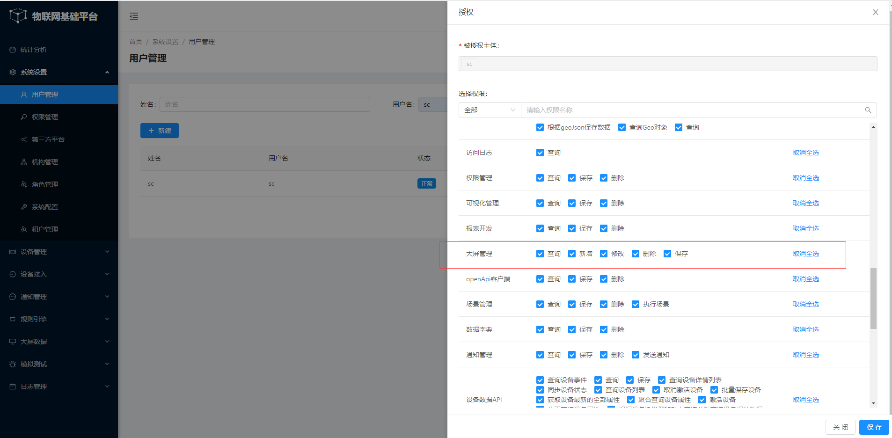
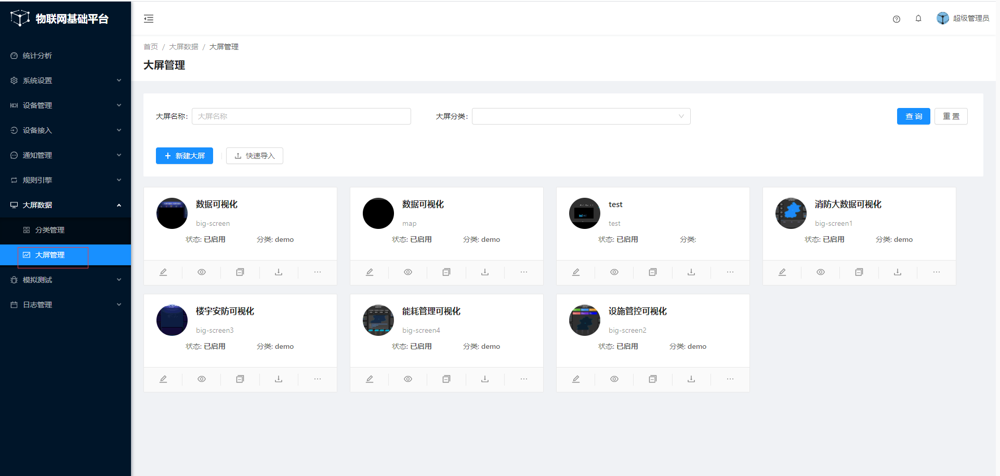

# 本地启动大屏

jetlinks的可视化数据大屏的前端是独立的，启动完jetlinks的平台前端和后端服务，如果你需要使用大屏可视化，还需要启动大屏前端

下载大屏前端代码：

```bash
$ git clone https://github.com/jetlinks/jetlinks-big-screen.git
$ cd jetlinks-big-screen
```

修改后台接口地址：进入在src/config.js，修改后端请求地址

```javascript
if(process.env.NODE_ENV === "production"){ // 生产环境
  axios.defaults.baseURL = origin
  window.requestUrl = origin
  window.wsUrl = origin.replace(window.location.protocol, 'ws:') //websocket
}else{//开发环境
  axios.defaults.baseURL = '你的后端地址'
  window.requestUrl = '你的后端地址'
  window.wsUrl = '你的后端ws地址'
}
```

启动：

```bash
$ cd jetlinks-big-screen
$ npm install
$ npm run serve 
```

在jetlinks中修改大屏跳转地址： jetlinks-pro/jetlinks-standalone/src/main/resources/application.yml
```yaml
api:
  urls:
    big-screen-path: http://localhost:9002/ #localhost根据大屏实际部署地址修改
```
创建大屏权限：进入平台，系统设置=>权限管理=>新建


赋权：进入平台，系统设置=>用户管理=>赋权，给用户赋权：



然后通过平台的大屏管理进入大屏：




