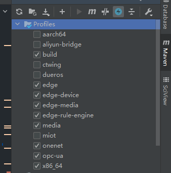

# 使用docker部署
## 项目在docker-compose拉取镜像时偶尔报出ERROR异常
**系统要求JDK 1.8.0_2xx <br/>
  ubantu 18.0.x系统<br/>
  自行配置国内镜像仓库地址
**

##   启动报elasticsearch节点无法进入
** 进入jetlinks挂载目录data文件夹内，进入data文件夹，找到elasticsearch目录 **
执行以下命令
```
chmod 777/755 -R elasticsearch
```

---
##   若启动时只有jetlinks的banner显示
**修改yml内logging.level.org.jetlinks的日志显示级别是debug**
```
docker logs -f [serviceName]
#具体的serviceName可通过docker-compose images 命令查看
```

---
##   启动无故失败
**
使用down命令清除docker-compose编排的挂载目录、网络以及缓存等消息，再重启
**
```
docker-compose down
docker-compose up -d
```

---
## 切换成mysql数据库报'unknown database jetlinks'

** 自行在mysql数据库里创建jetlinks的数据库，表可不建 **

---

## 项目启动报以下错误

**
查看日志启动时使用的profiles
修改启动类项目下的application以及profile指定激活的application文件里的**
> easyorm.dialect

> easyorm.default-schema

** 改成对应的数据库方言<br/>
例：使用embedded环境<br/>
默认数据库方言h2<br/>
如使用mysql：则需要指定dialect为mysql<br/>
default-schema也需要改成创建的数据库名
**

---

## 项目启动时发现admin用户没有完整的权限
* 登录http://demo.jetlinks.cn/ 账密：联系jetlinks方人员
* 系统设置→权限管理 →导出
* 回到自己部署的项目：系统设置→权限管理 →导入
* 用户管理→赋权→勾上需要的权限
* 退出重新登录

## 项目启动发现某些资源访问404
根据https://github.com/jetlinks/jetlinks-pro下
的操作步骤一步一步拉取代码<br/>
**不要跳过更新代码！！！<br/>
更改的代码也不要提交到jetlinks的代码仓库，请自行建立代码托管仓库！！！
**

>执行完成更新代码第二步后，将jetlinks-pro及jetlinks-standalone项目的分支切换至develop


**勾选需要的模块<br/>
基础必选模块：build、x86_64
**

---
## 设备无法连接上jetlinks平台
* 网络组件host建议填入0.0.0.0
* 端口：查看docker-compose.yml里的预留端口 默认预留的8100-8110端口 填入预留的端口，如需更多端口请自定义后重启项目即可
* 微服务版：在micro-service目录下的docker-compose.yml里的iot组件内添加自定义ports
* 修改后重启网络组件
* 仍然不能接入，查看云服务器：如阿里云，检查安全组内是否开放了预留端口
* 再尝试使用emqx socket_tool等工具连接

---
## 微服务版本在启动micro-service时提示无法连接127.0.0.1:6379/5432等端口
**
修改micro-service内的docker-compose.yml<br/>
查看给启动失败的component添加environment参数
**
>   添加下面的参数信息，ip换成自己的服务器公网ip <br/>
>   "spring.redis.host=192.168.22.65"<br/>
>   "elasticsearch.client.host=192.168.22.65"<br/>
>   "spring.r2dbc.url=r2dbc:postgresql://192.168.22.65:5432/jetlinks"<br/>

## 上传的协议包在发布的时候提示无法加载协议

**修改docker-compose.yml里面的**
>hsweb.file.upload.static-location
>
>改成能访问的公网ip，后缀目录请勿变化

---
## 大屏项目启动后访问的ip地址仍为127.0.0.1
**docker-compose.yml里面的jetlinks镜像下 environment参数内添加**
>api.urls.big-screen-path=http://公网ip:9002/

----

## 视频网关如何配置？
[视频网关配置](../media-guide/media-base-config.md)


