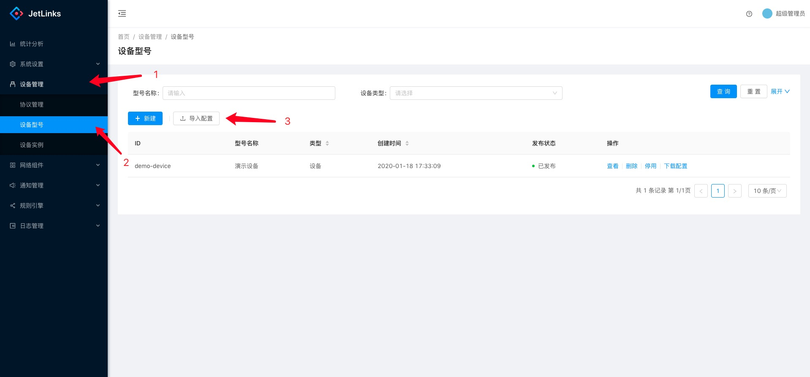
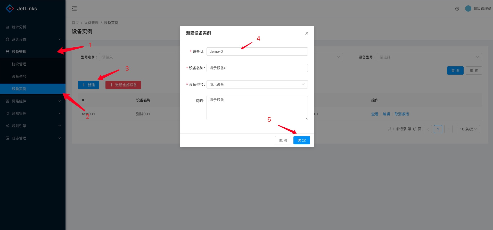
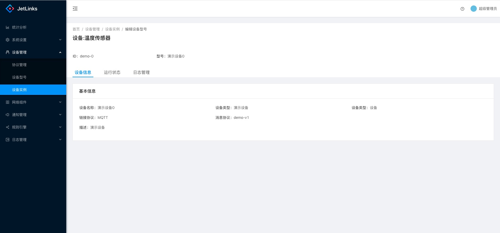
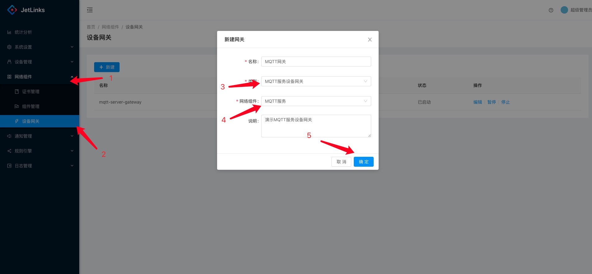

# 快速体验设备接入

成功启动系统后，启动模拟器模拟MQTT客户端与平台交互。
## 添加协议

进入`设备管理`-`协议管理`,点击`新建`.

- 协议名称: `演示协议`.
- 类型: `jar`.
- 类名: `org.jetlinks.demo.protocol.DemoProtocolSupportProvider`
- 上传jar包: 选择项目内文件: `simulator/demo-protocol-1.0.jar`


## 添加设备型号

进入`设备管理`-`型号管理`,点击`导入配置`. 选择项目内文件: `simulator/设备型号-演示设备.json`.



导入成功后,点击`操作列`-`发布`,如果状态为`已发布`,则点击`停用`后重新发布.


## 添加设备实例

进入`设备管理`-`设备实例`,点击`新建`.

- 设备id: `demo-0`
- 设备名称: `演示设备0`
- 设备型号: `演示设备`



点击确定,保存成功后, 点击`操作列`-`激活`. 点击`查看`可查看设备的基本信息以及`运行状态`

设备基本信息



运行状态


## 启动MQTT服务

进入`网络组件`-`组件管理`,点击`新增组件`.

- 组件名称: `MQTT服务`
- 组件类型: `MQTT服务`
- 线程数: `4` 可根据实际情况调整,一般`不大于主机CPU核心数*2`
- HOST: `0.0.0.0`
- PORT: `1883`
- TLS: `否`


点击保存,保存成功后,点击`启动状态`切换启动状态为启动.


## 启动设备网关

进入`网络组件`-`设备网关`,点击`新建`.

- 名称: `MQTT网关`
- 类型: `MQTT服务设备网关`
- 网络组件: `MQTT服务` 选择上一步创建的网络组件



点击确定,保存成功后,点击操作列中的`启动`.

## 启动模拟器

进入项目目录:`simulator`.

```bash
   $ cd simulator
   $ ./start.sh
```

启动成功后控制台应该会输出:

```text
...
create mqtt client: 1 ok
...
开始上报设备事件
成功推送设备事件:1

```

## 查看设备数据

进入`设备实例`,点击查看`demo-0`设备,点击`运行状态`,可看到设备上报的数据.

设备运行状态信息


设备上报的事件数据

